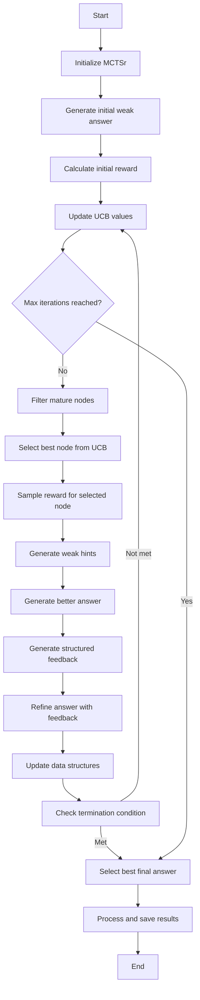
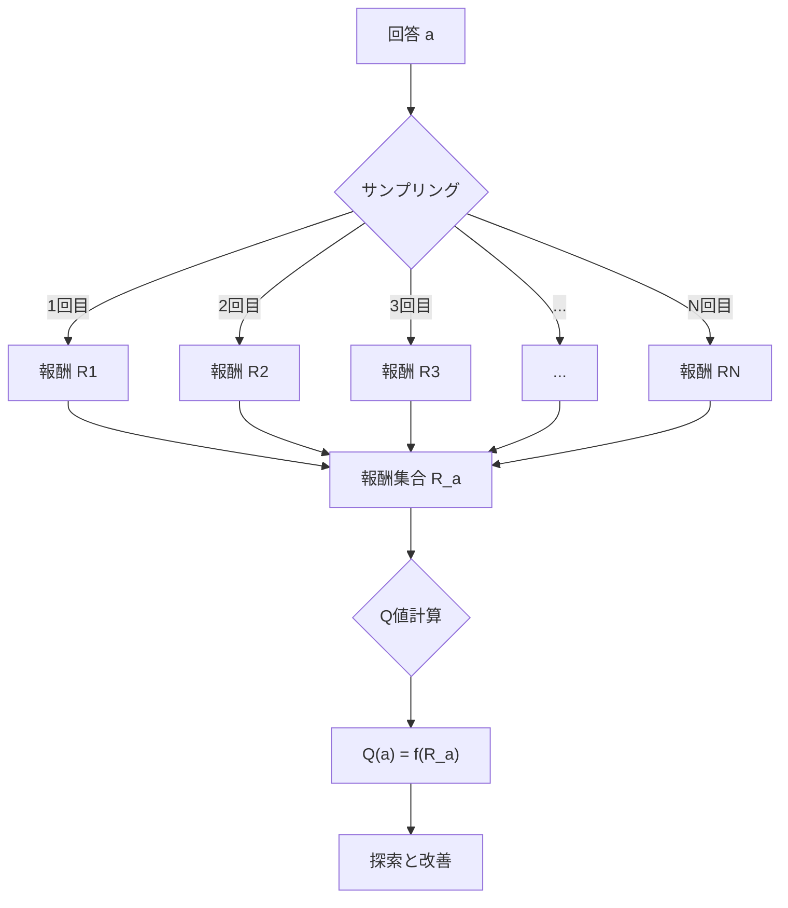
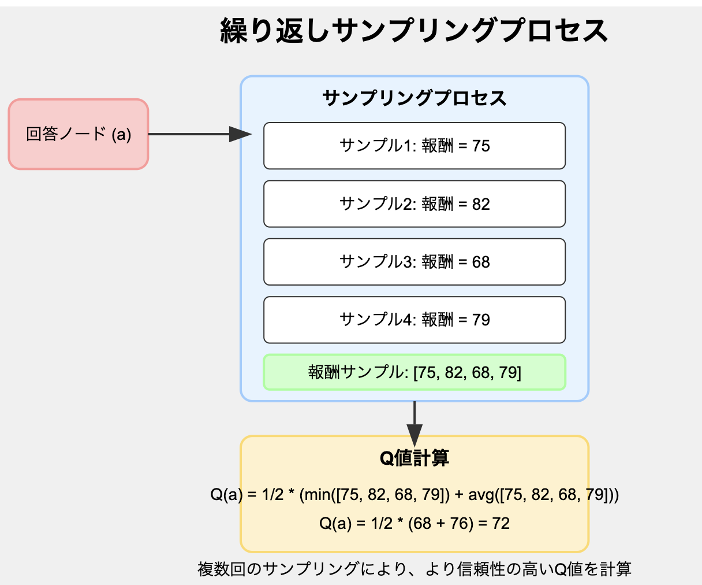
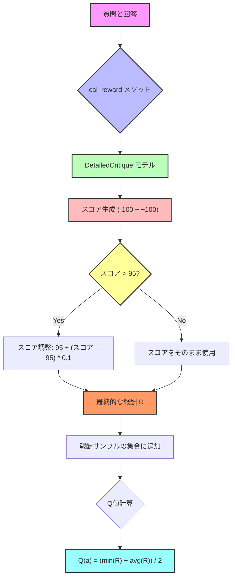
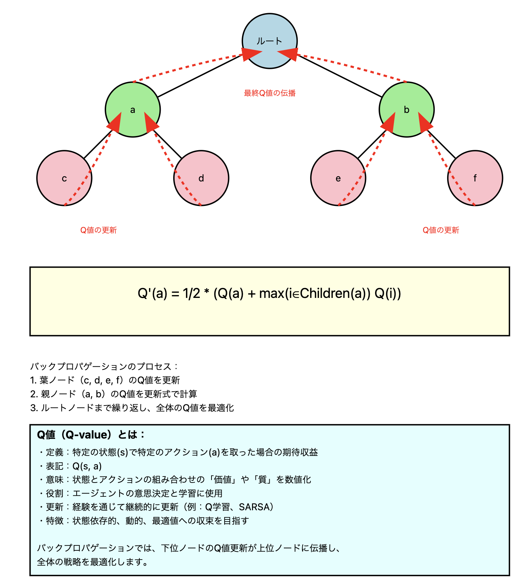

### アルゴリズムのフローとMCTSrの各メソッドの対応
| Mermaid工程 | 関連するメソッド | 目的 | 詳細 |
|-------------|------------------|------|------|
| Initialize MCTSr | `__init__` | アルゴリズムの実行に必要な初期設定を行う | - 問題、正解、最大反復回数などの基本パラメータを設定 - 探索ノード、報酬、ヒント、UCB値などのデータ構造を初期化 - アルゴリズムの動作を制御する閾値や制限を設定 |
| Generate initial weak answer | `get_weak_answer` | 問題に対する初期の回答を生成する | - 言語モデルを使用して、与えられた問題に対する最初の回答を作成 - この回答は「弱い」または「改善の余地がある」と想定される - 探索の出発点となる基準を設定 |
| Calculate initial reward | `sampling_reward`, `cal_reward` | 初期回答の品質を評価し、数値化する | - 生成された初期回答の正確さ、完全性、適切性を分析 - -100から100の範囲でスコアを割り当て - 初期状態の評価基準を確立し、今後の改善の基準点を設定 |
| Update UCB values | `update_ucb`, `compute_ucb` | 各ノードの上限信頼度（UCB）値を更新し、探索と活用のバランスを取る | - 各ノードの報酬と訪問回数に基づいてUCB値を計算 - 木構造全体にわたってUCB値を更新（バックプロパゲーション） - 次の探索で最も有望なノードを特定するための基準を提供 |
| Filter mature nodes | `filter_mature_node` | さらなる探索が有益な可能性のあるノードを識別する | - 十分に展開されていないノードや、さらなる改善の可能性があるノードを選別 - 探索の効率を高め、計算リソースを効果的に利用 |
| Select best node from UCB | `get_best_explore_from_ucb` | UCB値に基づいて、次に探索するべき最も有望なノードを選択する | - フィルタリングされたノードの中から最高のUCB値を持つノードを特定 - 探索と活用のバランスを取りながら、最も改善の可能性が高いノードを選択 |
| Sample reward for selected node | `sampling_reward`, `cal_reward` | 選択されたノードの現在の品質を評価する | - 選択されたノードの回答に対して新たに報酬を計算 - ノードの現在の状態を評価し、以前の評価との比較のための基準を提供 |
| Generate weak hints | `get_weak_hints` | 選択されたノードの回答を改善するためのヒントを生成する | - 回答の弱点や改善が必要な点を特定 - 具体的で建設的なフィードバックを提供 - 次のステップでの回答改善のための指針を提供 |
| Generate better answer | `get_better_answer` | 生成されたヒントに基づいて、改善された回答を作成する | - 前のステップで生成されたヒントを考慮に入れる - 言語モデルを使用して、より正確で完全な回答を生成 - 回答の質を段階的に向上させる |
| Generate structured feedback | `generate_structured_feedback` | 改善された回答に対してさらに詳細で構造化されたフィードバックを提供する | - 回答の様々な側面（推論過程、事実の正確さ、明確さなど）を評価 - 具体的で行動可能なフィードバックを構造化された形式で提供 - 次のステップでのさらなる改善のための詳細な指針を提供 |
| Refine answer with feedback | `refine_answer_with_feedback` | 構造化されたフィードバックを基に回答をさらに洗練させる | - 提供されたフィードバックの各ポイントに対処 - 回答の質をさらに向上させ、より完璧な解答に近づける - 改善プロセスの反復を通じて、回答の継続的な向上を図る |
| Update data structures | `add_to_hints_bank`, `add_to_childs`, `add_to_hints_reward_imp_bank` | アルゴリズムの内部状態を更新し、新しい情報を記録する | - 新しく生成されたヒント、改善された回答、報酬などを適切なデータ構造に追加 - 探索木の構造を更新（新しい子ノードの追加など） - 将来の決定と評価のための履歴情報を維持 |
| Check termination condition | `check_termination` | アルゴリズムを終了するべきかどうかを判断する | - 正解に到達したかどうかを確認 - 最大反復回数に達したかを確認 - 改善率が閾値を下回ったかどうかを評価 - 探索の深さが制限を超えていないかを確認 |
| Select best final answer | (メインループ内で実装) | 探索プロセス全体を通じて得られた最良の回答を選択する | - すべての生成された回答の中から最高の報酬を持つものを特定 - 必要に応じて、複数の高品質な回答の中から最適なものを選択 - アルゴリズムの最終的な出力となる回答を決定 |
| Process and save results | `process_example`, `main` | アルゴリズムの実行結果を処理し、保存する | - 最終的な回答、探索の履歴、各ステップでの中間結果などを構造化 - 結果を分析可能な形式（例：JSON）で保存 - 将来の分析や改善のために、プロセス全体の詳細な記録を維持 |****

### アルゴリズムのフローを表す mermaid グラフ

### 報酬サンプリングプロセスの図解

#### 詳細

### 報酬Rの決まり方

###  バックプロパゲーションの概念図

