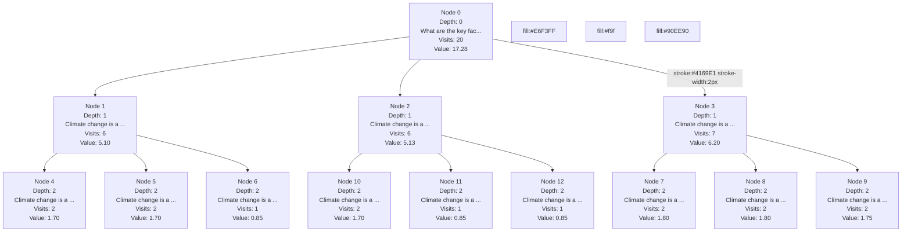

# MCTS Tree Visualization

Initial question: What are the key factors contributing to climate change, and what are the most effective strategies to mitigate its impact?

## Best Answer (Node 3)

Climate change is a complex issue driven by several key factors.  The primary driver is the increased concentration of greenhouse gases in the atmosphere, primarily caused by human activities such as: 

* **Burning fossil fuels:**  Coal, oil, and natural gas release massive amounts of carbon dioxide when burned for electricity, transportation, and industry.
* **Deforestation:** Trees absorb carbon dioxide, so cutting them down reduces the planet's ability to remove this greenhouse gas from the atmosphere.
* **Agriculture:** Livestock farming produces methane, a potent greenhouse gas, and agricultural practices like fertilizer use release nitrous oxide.

These factors trap heat in the atmosphere, leading to a gradual warming of the planet.  

Mitigating climate change requires a multifaceted approach:

* **Transition to renewable energy sources:**  Solar, wind, geothermal, and hydropower offer clean alternatives to fossil fuels.
* **Improve energy efficiency:**  Using less energy through better building insulation, efficient appliances, and sustainable transportation reduces demand.
* **Protect and restore forests:**  Trees act as carbon sinks, so preserving existing forests and planting new ones is crucial.
* **Sustainable agriculture:**  Practices like reducing fertilizer use, improving livestock management, and promoting agroforestry can lower emissions.
* **Carbon capture and storage:**  Developing technologies to capture carbon dioxide from the atmosphere and store it safely can help remove existing greenhouse gases.

Addressing climate change demands global cooperation, policy changes, technological innovation, and individual action. By implementing these strategies, we can strive to limit global warming and protect the planet for future generations.
